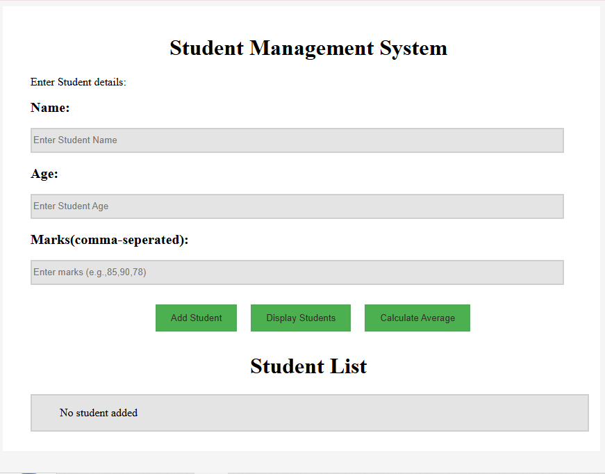

# 🎓 Student Management System

A Student Management System built using **HTML, CSS, and JavaScript** that allows users to add, manage, and analyze student records efficiently. The application automatically calculates total marks, averages, assigns grades, and provides an interactive interface for managing student data.

## 🌐 Live Demo

🔗 **Live Website:** https://kishmiscoderx.github.io/Student-Management-System/

## 📸 Preview



## ✨ Features

* Add Student Records
* Input Validation
* Automatic Total Marks Calculation
* Average Marks Calculation
* Automatic Grade Assignment
* Display Student Information
* Overall Class Average Calculation
* Dynamic DOM Manipulation

## 🛠️ Technologies Used

* HTML5
* CSS3
* JavaScript (ES6)

## 🚀 How to Use

1. Enter student details and marks.
2. Click the **Add Student** button.
3. The system automatically calculates:

   * Total Marks
   * Average Marks
   * Grade
4. View student records instantly.
5. Check the overall class average.

## 📂 Project Structure

```text
Student-Management-System/
│
├── Assignment_04.html
├── Assignmnet_04.css
├── Assignment_04.js
├── screenshot.png
└── README.md
```

## 🎯 Learning Outcomes

This project demonstrates:

* DOM Manipulation
* Event Handling
* Form Validation
* Arrays and Objects
* Data Processing and Calculations
* Responsive UI Design
* JavaScript Logic Building

## 👨‍💻 Author

**Kishmis Malhotra**

Aspiring Web Developer passionate about building responsive and user-friendly web applications using modern web technologies.

⭐ If you found this project useful, consider giving it a star on GitHub!
